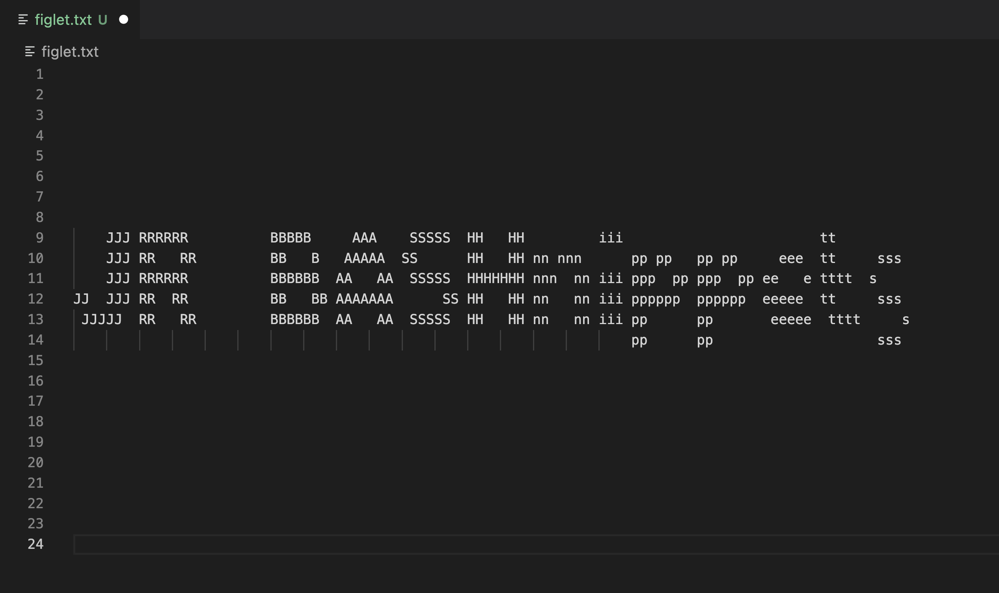

<br/>
<p align="center">
  <a href="https://github.com/jordiroca/jrbashnippets">
    
  </a>

  <h3 align="center">JR BASHnippets</h3>

  <p align="center">
    Snippets BASH para VS Code de Jordi Roca
    <br/>
    <br/>
    <a href="https://github.com/jordiroca/jrbashnippets/issues">Report Bug</a>
    .
    <a href="https://github.com/jordiroca/jrbashnippets/issues">Request Feature</a>
  </p>
</p>

     

## Table Of Contents

* [About the Project](#about-the-project)
* [Built With](#built-with)
* [Getting Started](#getting-started)
* [Usage](#usage)
* [License](#license)
* [Authors](#authors)

## About The Project



Bash Snippets for VS Code

## Built With

First built on December, 29th, 2022 using:

* [MacOS Ventura 13.1](https://www.apple.com/macos/ventura/)
* [Visual Studio Code 1.74](https://code.visualstudio.com/)
* [Bash 5.2.15](https://www.gnu.org/software/bash/)
* [ZSH 5.8.1](https://www.zsh.org/)

## Getting Started

Add the extension to VS Code

## Usage

When editing shellscript files use the following snippets:

* shebang

It will insert:

```
#!/usr/bin/env bash
# -*- coding: utf-8 -*-
```

* heredoc2var


## License

Distributed under the MIT License. See [LICENSE](https://github.com/jordiroca/jrbashnippets/blob/main/LICENSE.md) for more information.

## Authors

* [Jordi Roca](https://github.com/jordiroca/) - *JRBashnippets for VSCode*

